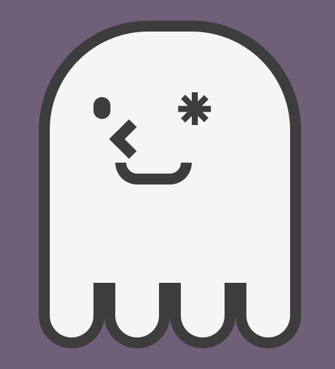
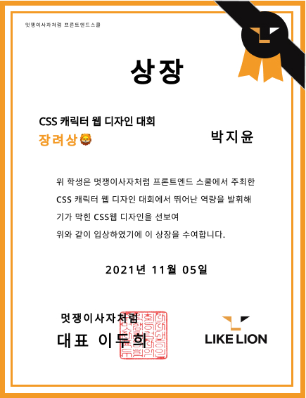

# 👻 character-making

</img>
</img>

## concept and process
CSS기초를 익히기 위해 두 단어를 결합한 "coding+ghost" CHOST라는 캐릭터를 만들어 보았습니다. 
캐릭터 내 요소를 나누어 class를 활용해 스타일링 하였습니다. 
부모요소와 자식요소의 position relative와 absolute 특성을 활용하여 캐릭터의 얼굴을 구현하였습니다. 

## award
멋쟁이사자처럼 프론트엔드스쿨에서 진행한 캐릭터그리기대회에서 투표를 통해 장려상을 받게되었고, 
CSS 기초에 대한 이해와 흥미를 가질 수 있었습니다. ☺️
